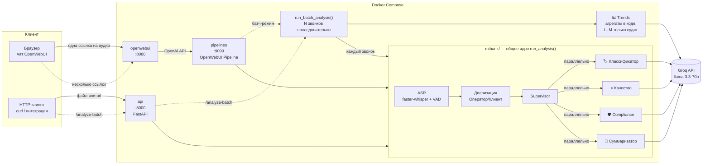

# 📞 MTBank Call Analytics

Прототип системы речевой аналитики контакт-центра: запись звонка автоматически
транскрибируется, размечается на **Оператора** и **Клиента**, после чего анализируется
четырьмя LLM-агентами. Результат доступен и в чате **OpenWebUI**, и через REST `POST /analyze`.

Тестовое задание на позицию AI Engineer. Исходный текст задания — [`docs/TASK.md`](docs/TASK.md).

---

## Содержание

- [Что умеет](#что-умеет)
- [Архитектура](#архитектура)
- [Быстрый старт](#быстрый-старт)
- [Как пользоваться](#как-пользоваться)
- [Контракт ответа](#контракт-ответа)
- [Обоснование решений](#обоснование-решений)
- [Агент трендов](#агент-трендов)
- [Качество ASR: WER-таблица](#качество-asr-wer-таблица)
- [Диаризация без pyannote](#диаризация-без-pyannote)
- [Тесты](#тесты)
- [Логирование](#логирование)
- [Метрики и дашборд (Grafana)](#метрики-и-дашборд-grafana)
- [Структура проекта](#структура-проекта)
- [Деплой](#деплой)
- [Известные ограничения](#известные-ограничения)

---

## Что умеет

| Возможность | Как |
|---|---|
| Транскрибация русской речи | `faster-whisper` (`small`, int8, встроенный Silero VAD) |
| Диаризация Оператор/Клиент | Собственный лёгкий алгоритм, **без pyannote** (только numpy) |
| Классификация обращения | Тема (кредиты / карты / переводы / жалобы) + приоритет |
| Оценка качества оператора | Чеклист из 4 пунктов + балл 0–100 |
| Compliance-контроль | Запрещённые фразы, обязательные disclaimers |
| Резюме и action items | 3–5 предложений + список задач |
| Два интерфейса | Чат OpenWebUI **и** REST `POST /analyze` |
| Форматы аудио | WAV, MP3, OGG, M4A, FLAC; 8 кГц (телефон) и 16 кГц |

**Производительность:** измерено на реальном звонке длиной **6.64 минуты** (длиннее, чем требует ТЗ):
полный анализ — ASR, диаризация и четыре агента — занял **24.9 с** при лимите 60 с.

---

## Архитектура



**Поток данных:** `аудио → скачивание/декодирование → faster-whisper → диаризация →
Supervisor разворачивает 4 агента параллельно → слияние в JSON`.

**Ключевой принцип.** И Pipeline, и REST API вызывают **одну и ту же функцию**
`mtbank.analysis.run_analysis()`. Логика не продублирована, поэтому чат и API физически не могут
разойтись в поведении. Pipeline остаётся настоящим оркестратором, а не обёрткой над HTTP.

---

## Быстрый старт

Нужен Docker и бесплатный ключ [Groq](https://console.groq.com) (регистрация без карты).

```bash
git clone https://github.com/ib0gdan/speech-analytics.git
cd speech-analytics

cp .env.example .env
# впишите в .env свой ключ: GROQ_API_KEY=gsk_...

docker compose up -d
```

Поднимутся четыре сервиса:

| Сервис | Порт | Назначение |
|---|---|---|
| `openwebui` | 3000 | Веб-чат |
| `pipelines` | 9099 | OpenWebUI Pipeline (внешний сервер) |
| `api` | 8000 | REST `POST /analyze` |
| `files` | 8899 | Раздаёт `test_data/` для демонстрации |

> При первом запуске сервисы **прогреваются**: скачивают и загружают модель whisper (~500 МБ).
> Пока в логах `api` не появилось `whisper_preloaded`, анализ будет ждать. Сделано намеренно —
> иначе загрузку модели (≈70 с на холодном контейнере) оплачивал бы первый же пользователь,
> вылетая за лимит в 60 секунд.

---

## Как пользоваться

### Чат OpenWebUI

Откройте <http://localhost:3000>, выберите модель **MTBank Call Analytics** и отправьте:

```
Проанализируй звонок: http://files/call_credit_consultation.wav
```

Вернётся транскрипт с разметкой говорящих, классификация, чеклист качества, compliance,
резюме и action items.

> **Почему `http://files/…`, а не `localhost`?** Аудио скачивает контейнер `pipelines`, и для
> него `localhost` — это он сам. `files` — имя сервиса в docker-сети.

Работает и **любая внешняя прямая ссылка** на аудио (`wav`, `mp3`, `ogg`, `m4a`, `flac`).
Тестовые записи лежат в репозитории публично — их можно вставить в чат на живом демо:

```
https://raw.githubusercontent.com/ib0gdan/speech-analytics/main/test_data/call_card_blocked.mp3
https://raw.githubusercontent.com/ib0gdan/speech-analytics/main/test_data/call_transfer_issue.wav
https://raw.githubusercontent.com/ib0gdan/speech-analytics/main/test_data/call_complaint_escalation.ogg
```

(второй файл — телефонный канал 8 кГц µ-law)

Без ссылки на аудио пайплайн отвечает как обычный ассистент через Groq — удобно проверить,
что LLM-бэкенд жив.

### REST API

```bash
# загрузка файла
curl -X POST http://localhost:8000/analyze -F "file=@test_data/call_dialog.mp3"

# по ссылке
curl -X POST http://localhost:8000/analyze \
     -H "Content-Type: application/json" \
     -d '{"url":"http://files/call_dialog.mp3"}'
```

Проверка живости — `GET /health`. Интерактивная документация — <http://localhost:8000/docs>.

**Ошибки** возвращаются как HTTP 400 с машинным кодом и русским сообщением:

```json
{"detail": {"code": "audio_decode_error",
            "message": "Не удалось декодировать аудио. Поддерживаются WAV, MP3, OGG, M4A, FLAC."}}
```

---

## Контракт ответа

```json
{
  "transcript": [
    {"speaker": "Оператор", "start": 0.0, "end": 5.2, "text": "Добрый день, МТБанк..."},
    {"speaker": "Клиент",   "start": 5.7, "end": 10.8, "text": "Здравствуйте, хочу узнать про кредит..."}
  ],
  "classification": {"topic": "кредиты", "priority": "medium"},
  "quality_score": {
    "total": 100,
    "checklist": {"greeting": true, "need_detection": true,
                  "solution_provided": true, "farewell": true}
  },
  "compliance": {"passed": true, "issues": []},
  "summary": "Клиент обратился с вопросом о кредите наличными...",
  "action_items": ["Отправить условия кредита на email клиента"],
  "request_id": "api-1783528…",
  "elapsed_s": 5.96
}
```

Если какой-то агент упал, его секция деградирует до безопасного значения, а в ответе появляется
поле `agent_errors` — анализ не теряется целиком.

---

## Обоснование решений

### 1. OpenWebUI Pipelines (внешний сервер), а не Functions

README проекта `open-webui/pipelines` начинается со слов **«DO NOT USE PIPELINES!»** — авторы
советуют встроенные Functions для простых задач. Исключение они называют прямо: *«computationally
heavy tasks (e.g. running large models) that you want to offload from your main Open WebUI
instance»*. Наш случай — ровно этот: локальный whisper и оркестрация четырёх агентов. Поэтому
внешний pipelines-сервер здесь не формальность ТЗ, а архитектурно верный выбор.

### 2. Groq как LLM-бэкенд

Нужен OpenAI-совместимый провайдер, который уложится в бюджет 60 секунд **вместе с ASR**. Groq
отдаёт `llama-3.3-70b` на порядок быстрее типичных облаков, имеет бесплатный tier и не требует
GPU у нас. Провайдер меняется одной переменной `LLM_BASE_URL` — код агентов не привязан к Groq.

### 3. `faster-whisper small`, а не `medium` (с оговоркой)

ТЗ просит `medium` или выше. Мы замерили ([таблица ниже](#качество-asr-wer-таблица)):

`medium` действительно **вдвое точнее** (2.7% против 5.2% WER) и формально укладывается в
лимит — **52 с** на 5-минутный звонок. Но это на разработческом Mac. Запаса нет: на целевом
CPU-хосте с 2 vCPU `medium` гарантированно выйдет за 60 секунд, а недоступное демо — это
дисквалификация.

**Решение:** `small` по умолчанию (19 с, запас ×3, WER 5.2%), `medium` — через valve
`WHISPER_MODEL` для мощного хоста. Компромисс осознанный и обратимый, а не «взяли что полегче».

### 4. Диаризация без pyannote

`pyannote` ориентирован на GPU, тянет torch и модель за токеном HF. Для двух говорящих в
телефонном разговоре это несоразмерно. Наш алгоритм использует только numpy —
[подробности ниже](#диаризация-без-pyannote), точность на тестовом диалоге **20/20 сегментов**.

### 5. Собственный Supervisor, а не LangGraph

Все четыре агента зависят **только** от транскрипта и независимы друг от друга. Это не граф
состояний с циклами и условными переходами, а обычный fan-out/join. LangGraph создан для другого;
здесь он добавил бы весь стек LangChain в контейнер, где уже лежит whisper, ради того, что
делает `ThreadPoolExecutor.map`.

Параллельность — не украшение, а бюджет: четыре последовательных вызова LLM складывались бы,
а параллельно стадия агентов стоит как самый медленный из них (**~1.1 с** вместо ~4.5 с).

### 6. `quality_score.total` считает код, а не модель

LLM отвечает только на четыре булевых вопроса чеклиста — это наблюдение, и оно ей даётся хорошо.
Итоговый балл считается по фиксированным весам (приветствие 20, выявление потребности 30,
решение 30, прощание 20). Так оценка **воспроизводима**, покрыта unit-тестом и не «плывёт» от
температуры модели.

### 7. Compliance в два слоя

Детерминированные правила дают **гарантию** на известные запрещённые формулировки («гарантирую
одобрение»), LLM ловит перефразировки и пропущенные disclaimers. `passed = false`, если возражает
хотя бы один слой. Отдельный тест проверяет, что снисходительная LLM **не может** отменить вердикт
правил.

---

## Агент трендов

Пятый агент отличается по форме от первых четырёх: те анализируют **один** звонок внутри
supervisor-а, а агент трендов запускается **после** — над списком результатов `run_analysis()` по
нескольким звонкам — и ищет закономерности между ними. Два входа: REST `POST /analyze-batch`
(список URL или загруженных файлов) и чат, где сообщение с **несколькими** аудио-ссылками
переключается в батч-режим (одна ссылка — прежний одиночный отчёт без изменений).

**Детерминированный слой (`compute_aggregates`) — чистый код, без LLM.** Тот же принцип, что и у
`quality_score.total`: числа считает код, поэтому они воспроизводимы и покрыты unit-тестами.
Считаются: количество звонков, распределение тем, средний/мин/макс `quality_score`, доля
выполнения каждого пункта чеклиста, доля звонков с провалом compliance и частота запрещённых фраз.
Частота фраз берётся напрямую из `compliance.check_forbidden` — детерминированный набор правил
остаётся единственным источником истины, и перефразировки LLM не могут исказить счётчик.

**LLM-слой — только суждение.** Один вызов Groq возвращает `patterns`, `causes`,
`recommendations` и — главное — **семантически сгруппированные** action items и нарушения
compliance. Группировка отдана модели намеренно: одна и та же задача формулируется в каждом звонке
по-разному («отправлю условия» / «вышлю по кредиту»), и точное сравнение строк объединить их не
может. Промпт явно запрещает модели считать числа — агрегаты уже посчитаны кодом.

**Сбой LLM не теряет агрегаты.** Вызов модели обёрнут в try/except: при любой ошибке остаются
пустые поля суждения, а детерминированные агрегаты возвращаются как есть. Это и есть смысл
разделения — код выживает, модель опциональна. Отдельный тест проверяет деградацию.

**Батч выполняется последовательно — осознанно.** Каждый `run_analysis` делает свой прогон
faster-whisper, а это CPU-bound стадия, которая уже насыщает целевые 2 vCPU (модель — общий
прогретый синглтон, но активации инференса и буферы сигнала — на каждый параллельный звонок).
Параллельный запуск N звонков перегрузил бы CPU (выигрыша по времени на доминирующей ASR-стадии
почти нет) и умножил бы пиковую память — опасно на VPS с 2 ГБ. Параллельность supervisor-а —
другой случай: 4 сетевых вызова LLM **внутри** одного звонка, где конкуренция бесплатна. Поэтому:
внутри звонка — параллельно, между звонками — последовательно.

**Один упавший звонок не топит батч.** Каждый источник обёрнут в try/except: успешные анализы
идут в `calls`, ошибки — в `errors` (`{source, code, message}`), тренды считаются только по
успешным. Если упали все (или список пуст) → безопасные пустые агрегаты, без деления на ноль.
Размер батча ограничен (`MAX_BATCH_SOURCES = 20`) — это ограничивает усиленную нагрузку
батч-эндпоинта (fetch + CPU); превышение → `AnalysisError(code="batch_too_large")` → HTTP 400.

```bash
curl -X POST http://localhost:8000/analyze-batch \
     -H "Content-Type: application/json" \
     -d '{"urls":["http://files/call_card_blocked.mp3","http://files/call_credit_consultation.wav"]}'
```

Ответ — `{"calls": [...], "errors": [...], "trends": {...}, "request_id": ..., "elapsed_s": ...}`,
где `elapsed_s` — реальный замер (батч из 2 звонков на прогретой модели — **18.1 с**).

---

## Качество ASR: WER-таблица

Метрика — `jiwer` против эталонных транскриптов. Замеры последовательные, модель прогрета
(иначе первый файл впитывает время загрузки и коэффициент реального времени врёт).

**Нормализация обязательна:** whisper пишет «15 тысяч» и «18%», эталон — «пятнадцать тысяч» и
«восемнадцати процентов». Без приведения (цифры→слова, `%`→«процентов», `ё`→`е`, пунктуация) мы
измеряли бы форматирование, а не распознавание.

### Сравнение моделей (весь корпус, 7.4 мин)

| Модель | WER | CER | Быстрее реального времени | 5-мин звонок | Вердикт |
|---|---|---|---|---|---|
| `base` | 8.6% | 1.4% | 41.3× | ~7 с | Быстро, но заметно хуже |
| **`small`** | **5.2%** | **0.8%** | **15.5×** | **~19 с** | ✅ дефолт: точность/запас |
| `medium` | 2.7% | 0.3% | 5.7× | ~52 с | Точнее, но без запаса на CPU |

### Подробно, модель `small`

| Файл | Формат | Частота | Слов | WER | CER | Аудио | ASR |
|---|---|---|---|---|---|---|---|
| `call_card_blocked.mp3` | mp3 | 16 кГц | 125 | **2.4%** | 0.2% | 92 с | 5.6 с |
| `call_complaint_escalation.ogg` | ogg | 16 кГц | 100 | **2.0%** | 0.3% | 62 с | 4.2 с |
| `call_credit_consultation.wav` | wav | 16 кГц | 147 | **5.4%** | 0.6% | 102 с | 6.0 с |
| `call_deposit_info.mp3` | mp3 | 16 кГц | 45 | **8.9%** | 0.9% | 36 с | 2.5 с |
| `call_dialog.mp3` | mp3 | 16 кГц | 91 | **6.6%** | 1.2% | 47 с | 3.3 с |
| `call_dialog.wav` | wav | 16 кГц | 91 | **7.7%** | 1.5% | 47 с | 3.4 с |
| `call_transfer_issue.wav` | wav | **8 кГц µ-law** | 78 | **6.4%** | 1.0% | 58 с | 3.9 с |
| **Итого** | | | **677** | **5.2%** | **0.8%** | 446 с | 28.9 с |

Телефонный канал 8 кГц деградирует незначительно (6.4%) — VAD и int8 держат удар.

Воспроизвести: `docker compose exec api python scripts/eval_wer.py --model small --worst`
(флаг `--worst` печатает пословный diff худшего файла).

### Тестовые данные

Корпус сгенерирован `scripts/make_test_data.py` через **edge-tts** двумя разными нейроголосами
(оператор — женский `ru-RU-SvetlanaNeural`, клиент — мужской `ru-RU-DmitryNeural`), поэтому
эталон точен по построению: текст реплики и есть ground truth.

6 записей, **7.4 минуты**, форматы wav/mp3/ogg, включая **8 кГц µ-law** (телефонный кодек) и
**два диалога длиннее минуты**.

> **Находка при подготовке данных.** `edge-tts` стримит аудио, и при сетевом сбое `save()`
> молча записывает **обрезанный** файл, не бросая исключение. Так из корпуса бесследно пропала
> целая реплика клиента — это проявилось только как необъяснимый выброс WER (12.9% на одном
> файле). Теперь генератор сверяет длительность каждой реплики с числом слов и пересинтезирует
> при обрыве. После починки WER этого файла упал до 5.4%.

---

## Диаризация без pyannote

Задача — разделить двух говорящих в телефонном разговоре на CPU. Решение использует **только
numpy** и опирается на несколько наблюдений, полученных экспериментально:

1. **Сегменты whisper — это не реплики.** Whisper режет по своим границам декодирования и легко
   рвёт фразу пополам. Хуже: с `vad_filter=True` он вырезает тишину, и его таймкоды возвращаются
   **сплошными** (зазор = 0) даже там, где говорящий сменился. Поэтому паузы мы ищем **в самом
   сигнале** (энергия по кадрам), а не в таймкодах.

2. **Признаки должны описывать голос, а не слова.** Первая версия использовала энергии мел-полос —
   и точность рухнула почти до случайной: мел-профиль кодирует **какие звуки** произнесены, и
   заглушал сигнал о том, **кто** говорит. Работают: медианная **F0** (высота тона — сильнейший
   дешёвый признак диктора), её разброс, спектральный центроид и **MFCC 1..6** (тембр).
   После z-нормировки F0 получает вес ×4.

3. **k-means (k=2)** по репликам, а не по сегментам: у реплики больше аудио, оценка F0 устойчивее.

4. **Короткие реплики решаются локально.** У фрагмента вроде «Хорошо.» (1 с) слишком мало
   вокализованных кадров, F0 шумит, и глобальная кластеризация ошибается. Такие реплики
   переназначаются по **акустически ближайшему соседу** — та же запись, тот же канал.

5. **Роли** назначаются по репликам оператора («МТБанк», «меня зовут», «чем могу помочь»).
   Если подсказок нет — первым говорит оператор.

**Результат:** на тестовом двухголосом диалоге — **20 из 20 сегментов** размечены верно.
Путь до этого: мел-признаки ≈ случайно → F0 с весом 90% → группировка по паузам из таймкодов
whisper 65% (провал — зазоров нет) → паузы из сигнала 95% → локальное решение коротких реплик
**100%**.

---

## Тесты

```bash
docker compose exec api pytest                  # 67 тестов, ~5 с
docker compose exec api pytest -m "not slow"    # быстрые, без модели и сети (~0.3 с)
```

| Файл | Тестов | Покрывает |
|---|---|---|
| `tests/test_agents.py` | 22 | Каждый из 4 агентов по отдельности |
| `tests/test_pipeline.py` | 9 | Supervisor + сквозной `аудио → JSON` |
| `tests/test_diarizer.py` | 7 | Диаризация, k-means, назначение ролей |
| `tests/test_api.py` | 8 | REST-контракт и коды ошибок (`/analyze`, `/analyze-batch`) |
| `tests/test_trends.py` | 15 | Агрегаты, деградация при сбое LLM, устойчивость батча |
| `tests/test_metrics.py` | 6 | Счётчики в `run_analysis`/батче, `/metrics`, деградация агентов |
| **Итого** | **67** | |

**LLM в тестах всегда подменена фейком.** Unit-тест обязан проверять *нашу* логику — валидацию,
приведение типов, подсчёт баллов, слияние слоёв compliance, деградацию при сбое агента, — а не
вкус модели. Иначе он медленный, платный, требует ключ и мигает. Интеграционный тест при этом
гоняет **настоящий faster-whisper** (в этом его смысл) и помечен `slow`.

Набор проверен мутациями: поломка весов `quality`, жёсткого слоя compliance, белого списка тем
или обработки падений в supervisor — **каждая делает набор красным**.

---

## Логирование

Структурированные JSON-логи фиксируют вход и выход **каждого** агента, связанные общим
`request_id`:

```json
{"ts":"2026-07-09T15:19:51Z","level":"INFO","logger":"mtbank.agents.llm","event":"agent_input",
 "request_id":"api-1783…","agent":"compliance","model":"llama-3.3-70b-versatile","input":"Транскрипт…"}
{"ts":"2026-07-09T15:19:52Z","level":"INFO","logger":"mtbank.agents.llm","event":"agent_output",
 "request_id":"api-1783…","agent":"compliance","elapsed_s":0.94,"output":"{\"passed\": false, …}"}
```

Стадии: `analysis_start → transcribe_done → diarize_done → agents_start → agent_input/agent_output
(×4) → agents_done → analysis_done`.

```bash
docker compose logs -f api
```

---

## Метрики и дашборд (Grafana)

> ТЗ: «метрики: количество звонков, quality_score, топ тематик» (Бонус B).

**Что отдаётся в Prometheus-формате:**

| Метрика | Тип | Описание |
|---|---|---|
| `mtbank_calls_total` | Counter | Всего проанализировано звонков (чат + REST + батч) |
| `mtbank_topic_total{topic=...}` | Counter | Звонки по теме (`кредиты`/`карты`/`переводы`/`жалобы`/`другое`) |
| `mtbank_quality_score` | Histogram | Балл качества 0–100 (бакеты 20/40/60/80/100) |
| `mtbank_compliance_failed_total` | Counter | Звонки с провалом compliance-контроля |
| `mtbank_agent_failed_total{agent=...}` | Counter | Агент упал и вернул `fallback()` |
| `mtbank_analysis_duration_seconds` | Histogram | Длительность `run_analysis` |

**Деградировавший агент — это не данные.** `quality.fallback()` возвращает `total = 0`, а
`classifier.fallback()` — тему `другое`. Записать их в метрики значило бы отрапортовать
«операторы набрали 0» и раздуть тему «другое» ровно тогда, когда на самом деле просто лежал
LLM: метрика врала бы именно в тот момент, когда система нездорова. Поэтому срез упавшего
агента **не записывается**, а сама деградация видна в `mtbank_agent_failed_total`. Неизвестная
оценка остаётся неизвестной: разрыв между `mtbank_calls_total` и `mtbank_quality_score_count` —
это в точности число деградаций, а панель среднего балла показывает «нет данных» вместо лживого
нуля.

По той же причине доля нарушений комплаенса считается как
`compliance_failed / (calls_total − agent_failed{agent="compliance"})`: звонки, где
compliance-агент не отработал, исключены из знаменателя — иначе мёртвый LLM тихо занижал бы
долю нарушений.

**Почему инкремент живёт внутри `run_analysis`, а не в API-слое.** `pipelines` (чат) и `api`
(REST) — два отдельных процесса с отдельными реестрами метрик. `run_analysis` — единственная
функция, которую импортируют оба, плюс `run_batch_analysis` вызывает её на каждый источник
батча. Один вызов `metrics.record_analysis(...)` в конце `run_analysis` покрывает разом чат,
REST и батч; инструментирование только в API-слое молча пропустило бы чат — основной
интерфейс по условиям задания.

**Честно про два таргета.** Поскольку у процессов раздельные in-memory реестры (по одному
uvicorn worker'у на процесс — без pushgateway и multiprocess-режима), настоящий общий счётчик
существует только в дашборде: Prometheus скрейпит **оба** `api:8000/metrics` и
`pipelines:9100/metrics`, а каждая панель дашборда суммирует `sum(...)` / `sum by (topic)(...)`
— так видно правдивый суммарный total, а не только REST-часть.

**Как поднять (одна команда):**

```bash
docker compose --profile metrics up -d --build
```

Дашборд **«MTBank Call Analytics»** появляется в Grafana сам, без единого клика (provisioned
datasource + provisioned dashboard JSON):

- Grafana: <http://localhost:3001> (анонимный Viewer, авторизация не нужна)
- Prometheus targets: <http://localhost:9090/targets> — оба job'а (`mtbank-api`,
  `mtbank-pipelines`) должны быть `up`

Три обязательных по заданию панели — **количество звонков**, **quality_score** (средний +
распределение), **топ тематик** — плюс доля нарушений комплаенса, p95 длительности анализа и
деградации агентов.

**Измерено:** отдельный запуск REST `POST /analyze` и отдельное чат-сообщение с аудио-ссылкой
через `pipelines` (`POST :9099/chat/completions`) — Prometheus `sum(mtbank_calls_total)`
корректно вырос `0 → 1` после REST-вызова (весь прирост на таргете `mtbank-api`) и `1 → 2`
после чат-вызова (прирост на таргете `mtbank-pipelines`) — оба пути считаются, дашборд
действительно был бы заполнен, а не пуст.

**Опционально, изоляция от прод-деплоя.** `prometheus`/`grafana` объявлены с
`profiles: ["metrics"]` в `docker-compose.yml` — обычный `docker compose up -d` их не трогает,
и стек не появляется в `docker-compose.prod.yml` вовсе: 2 ГБ VPS-деплой не подорожал.
Измеренный расход `prometheus`+`grafana` вместе (`docker stats`, сразу после старта, до
накопления истории): **~95 МиБ** — заметно меньше HANDOFF-прикидки «~350 МиБ»; на 4 ГБ
локальной машине не критично в любом случае.

---

## Структура проекта

```
mtbank/                    # общее ядро — не знает ни про OpenWebUI, ни про FastAPI
├── analysis.py            # run_analysis(): единственная точка входа (один звонок)
├── batch.py               # run_batch_analysis(): N звонков последовательно + тренды
├── errors.py              # доменные ошибки → HTTP 400 / сообщение в чат
├── logging_config.py      # JSON-логи
├── asr/
│   ├── audio.py           # скачивание/декодирование (URL, путь, байты)
│   ├── transcriber.py     # faster-whisper, ленивая загрузка модели
│   └── diarizer.py        # Оператор/Клиент без pyannote
└── agents/
    ├── llm.py             # OpenAI-совместимый клиент (Groq), JSON-режим
    ├── classifier.py      # 🏷️ тема + приоритет
    ├── quality.py         # ⭐ чеклист + детерминированный балл
    ├── compliance.py      # 🛡️ правила + LLM
    ├── summarizer.py      # 📝 резюме + action items
    ├── trends.py          # 📊 тренды по нескольким звонкам (агрегаты в коде)
    └── supervisor.py      # fan-out/join четырёх агентов

pipelines/mtbank_pipeline.py   # OpenWebUI Pipeline (тонкий, вызывает ядро)
api/main.py                    # FastAPI POST /analyze + /analyze-batch (тоже ядро)
tests/                         # 67 тестов
scripts/                       # генерация корпуса, оценка WER
test_data/                     # 6 записей + эталонные транскрипты
deploy/                        # прод-образы и скрипт развёртывания
```

---

## Деплой

### Вариант 1 — VPS (постоянный адрес)

Прод-стек — `docker-compose.prod.yml`: те же сервисы плюс **Caddy**, который выдаёт HTTPS
автоматически (сертификат Let's Encrypt для `<ip>.sslip.io`, домен покупать не нужно).

На чистом Ubuntu-сервере (DigitalOcean, Hetzner, любой VPS):

```bash
export GROQ_API_KEY=gsk_ваш_ключ
curl -fsSL https://raw.githubusercontent.com/ib0gdan/speech-analytics/main/deploy/vps/setup.sh | bash
```

Скрипт ставит Docker, клонирует репозиторий, определяет публичный IP, настраивает HTTPS и
поднимает стек.

**Требования к серверу:** Ubuntu 22.04+, **2 vCPU**, открытые порты 80/443.

| RAM | Модель | Потребление | WER | Комментарий |
|---|---|---|---|---|
| **2 ГБ** | `base` | 1.69 ГиБ | 8.6% | Влезает с запасом ~170 МиБ; `setup.sh` добавит swap |
| **4 ГБ** | `small` | 2.3 ГиБ | 5.2% | Комфортно, лучше распознавание |

`setup.sh` сам выбирает модель по объёму памяти и добавляет swap на маленьких машинах
(сборка образов кратковременно требует больше памяти, чем сервисы в работе).

Измеренное потребление (после прогрева, во время анализа):

| Сервис | Память |
|---|---|
| `openwebui` | 681 МиБ |
| `pipelines` | 1.13 ГиБ (whisper `small` + инференс) |
| `api` | 445 МиБ |
| `files` | 15 МиБ |
| **Итого** | **~2.3 ГиБ** |

По умолчанию OpenWebUI тянет **torch** и две локальные embedding-модели для поиска по документам
плюс собственный whisper для голосового ввода — ничем из этого мы не пользуемся, наш ASR живёт в
`pipelines`. Отключение (`RAG_EMBEDDING_ENGINE=openai`, `AUDIO_STT_ENGINE=openai`) экономит
**~360 МиБ**. Дальше можно урезать, взяв `WHISPER_MODEL=base` (~350 МиБ на процесс, WER 8.6%).

Бесплатные тарифы на 512 МБ (Render Free и подобные) стек не поднимут — **проверено
эмпирически**: контейнер стартует, `api` отвечает, а OpenWebUI не поднимается и отдаёт 502.

### Вариант 2 — Cloudflare Tunnel (без сервера, бесплатно)

Публикует локальный стек по HTTPS без аренды VPS. Туннель может отдать только **один** порт,
поэтому в compose есть сервис `proxy` (nginx), сводящий чат и REST на порт 8080 — та же
маршрутизация, что у Caddy в проде.

```bash
docker compose up -d
cloudflared tunnel --url http://localhost:8080
```

Выведет адрес вида `https://<случайное-имя>.trycloudflare.com`. Вебсокеты OpenWebUI через
туннель работают (проверено). Ограничения: адрес меняется при перезапуске, а машина должна быть
включена.

### Вариант 3 — all-in-one образ

В `deploy/hf/` лежит **all-in-one образ** (все сервисы в одном контейнере за nginx, порт из
`$PORT`) — для платформ, дающих ровно один контейнер и один порт (Render, Cloud Run, HF Spaces).
Проверен на Render: `api` поднимается, OpenWebUI на free-тарифе (512 МБ) — нет.

---

## Известные ограничения

- **Перекрывающаяся речь.** Если говорящие перебивают друг друга без паузы, они попадают в одну
  реплику. Для двух собеседников в телефонном разговоре это редкость; корректная обработка
  overlap требует полноценного диаризатора.
- **Одногендерные голоса.** F0 — сильнейший признак, но у двух мужчин или двух женщин разделение
  опирается в основном на тембр (MFCC) и будет менее надёжным.
- **Всегда ровно два говорящих.** Конференц-звонок на трёх участников не поддерживается.
- **Нормализация чисел при WER.** `num2words` даёт именительный падеж («восемнадцать»), эталон
  может содержать «восемнадцати» — такие расхождения завышают WER на доли процента.
- **Модель грузится дважды.** `api` и `pipelines` держат по своей копии whisper. На 4 ГБ это
  умещается, но для экономии памяти ASR стоило бы вынести в отдельный сервис.
- **Бонусное задание** real-time WebSocket не реализовано.

---

## Лицензия и происхождение

Код написан для тестового задания. Использованы открытые библиотеки: `faster-whisper`
(CTranslate2), `FastAPI`, `OpenWebUI Pipelines`, `jiwer`, `edge-tts`. Диаризация реализована
самостоятельно (мел-фильтры, автокорреляционная оценка F0, k-means — на numpy).
